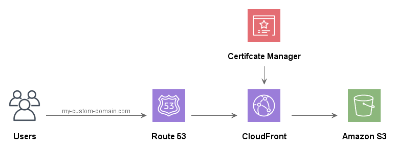

# AWS - Static Hosting Using Amazon S3 + CloudFront

Amazon Web Services (AWS) is a cloud computing platform that provides a wide range of cloud services to individuals, companies, and governments. AWS services include computing, storage, networking, databases, analytics, machine learning, security, and many more. AWS is designed to be highly scalable, flexible, and cost-effective, making it a popular choice for hosting and managing web applications. In this article, we will focus on how to build a React app on AWS S3 with static hosting and CloudFront.

# Why Use AWS S3 with Static Hosting and CloudFront for a React App?

React is a popular JavaScript library for building user interfaces. It is commonly used to build single-page applications (SPAs) that run entirely in the browser. SPAs are a great fit for static hosting since they don't require server-side processing, which makes them faster and less resource-intensive to host.

AWS S3 is an object storage service that is designed for storing and retrieving large amounts of data, including static files such as HTML, CSS, and JavaScript. S3 is highly scalable, reliable, and secure, and is commonly used for static web hosting.

CloudFront is a content delivery network (CDN) that is designed to improve the performance and reliability of web applications. CloudFront caches content at edge locations around the world, which means that users can access the content more quickly and reliably. CloudFront can also encrypt content, block malicious traffic, and provide analytics and logging.

By using AWS S3 with static hosting and CloudFront, you can benefit from the scalability and reliability of S3, the fast delivery and caching of CloudFront, and the cost-effectiveness of static hosting. Let's go through the steps of building a React app on AWS S3 with static hosting and CloudFront.



# Step 1: Build Your React App

The first step in building a React app on AWS S3 with static hosting and CloudFront is to create your React app. There are several ways to create a React app, but one of the most common methods is to use the create-react-app tool.

Create-react-app is a command-line tool that sets up a new React project with a basic file structure and build process. To use create-react-app, you will need to have Node.js and npm installed on your computer.

To create a new React app with create-react-app, open a command prompt or terminal and run the following command:

```
npx create-react-app my-app
```

This will create a new React app in a directory called my-app. You can replace my-app with the name of your app.

Once the app is created, you can navigate to the app directory by running the following command:

```
cd my-app
```

The create-react-app tool creates a basic file structure and build process for your React app. The main files and directories that you will work with are:

public/: This directory contains the public assets for your app, including the HTML file that serves as the entry point for your app.
src/: This directory contains the source code for your app, including the JavaScript files that define your React components.
You can run the app locally by running the following command:

```
npm start
```

This will start a development server that serves the app on http://localhost:3000.

When you are ready to build the app for production, you can run the following command:

```
npm run build
```

This will generate a production-ready build of your app in the build/ directory.

# Step 2: Create an S3 Bucket

The next step is to create an S3 bucket to store the files for your React app. An S3 bucket is a container for objects (files) in S3. To create an S3 bucket, follow these steps:

1. Log in to the AWS Management Console.
2. Navigate to the S3 service.
3. Click the "Create bucket" button.
4. Choose a name for your bucket, and select a region.
5. Choose "Versioning" if you want to enable versioning for your objects. This can be helpful if you want to restore previous versions of your objects.
6. Choose "Server access logging" if you want to log access to your objects.
7. Click the "Create bucket" button to create the bucket.
8. Once you have created the S3 bucket, you can upload the files for your React app to the bucket.

# Step 3: Upload Your Files

To upload the files for your React app to the S3 bucket, follow these steps:

1. Navigate to the S3 service in the AWS Management Console.
2. Click on the name of the bucket you created in Step 2.
3. Click the "Upload" button.
4. Click the "Add files" button, and select the files from the build/ directory of your React app.
5. Click the "Upload" button to upload the files to the S3 bucket.

# Step 4: Set Up CloudFront

The next step is to set up CloudFront to serve your React app from the S3 bucket. CloudFront is a content delivery network that can cache your content at edge locations around the world, which can improve the performance and reliability of your app. To set up CloudFront, follow these steps:

1. Navigate to the CloudFront service in the AWS Management Console.
2. Click the "Create distribution" button.
3. Choose "Web" for the delivery method.
4. Click the "Get Started" button under the "Web" option.
5. In the "Origin Domain Name" field, choose the S3 bucket that you created in Step 2.
6. In the "Viewer Protocol Policy" field, choose "Redirect HTTP to HTTPS" to enforce HTTPS.
7. In the "Object Caching" field, choose "Use Origin Cache Headers" to use the cache settings of the objects in your S3 bucket.
8. In the "Default TTL" field, set a value for the default time-to-live (TTL) for your objects. This is the amount of time that objects will be cached in CloudFront.
9. Click the "Create Distribution" button to create the CloudFront distribution.

Note that it may take some time for the distribution to be created and for the changes to take effect.

# Step 5: Configure DNS

The final step is to configure DNS to point your domain name to the CloudFront distribution. To do this, follow these steps:

1. Navigate to your DNS provider (e.g., Route 53, GoDaddy, etc.).
2. Create a new CNAME record that points to the CloudFront domain name. 3. You can find the CloudFront domain name in the "Domain Name" column of the CloudFront distribution list.
4. Wait for the DNS changes to propagate. This can take up to 24 hours, but usually happens much faster.
5. Once the DNS changes have propagated, you should be able to access your React app at the domain name you configured.

# Conclusion

Through this demo, we have covered the steps to build a React app on AWS S3 with static hosting and CloudFront. We have also explained the purpose of each AWS service and how they work together to provide a scalable, reliable, and cost-effective hosting